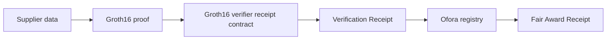

# Ofora

**Ofora makes confidential procurement decisions independently verifiable.**

Ofora is a hackathon MVP for procurement teams that need to protect supplier commercial information while proving that an award followed rules locked before submissions began.

## Problem

Public procurement often forces an unfair choice: expose supplier commercial information, or ask stakeholders to trust the award decision.

## Solution

Ofora locks supplier-selection rules before submissions, keeps commercial proposals protected, and proves the final award followed those rules.

## Live Demo Scenario

**Emergency Solar Lantern Procurement**

- Meridian Industrial Ltd. is ineligible because delivery exceeds the 14-day requirement.
- Atlas Supply Group is eligible but blocked because another eligible supplier scores higher.
- Nova Relief Systems validates as the correct award.
- Fair Award Receipt `FAR-OFR-2026-041-NOVA` is finalized on Stellar testnet.

## How It Works

Create tender -> Lock rules -> Receive confidential submissions -> Evaluate eligibility -> Validate award -> Publish a defensible record

## What ZK Proves

Nova is eligible and scored at least as highly as every other eligible supplier under the tender rules locked before submissions began.

## Privacy Model

Public:

- tender reference
- policy commitment
- bid commitments
- verification context commitment
- Fair Award Receipt
- verification and finalization references

Private:

- bid prices
- delivery details
- quality and capability inputs
- internal scores
- salts
- witnesses

## Stellar Architecture



The verifier receipt contract verifies Nova's Groth16 proof and stores a single-use verification receipt. The Ofora registry recomputes the expected public verification context from locked tender state, consumes the receipt, and finalizes the Fair Award Receipt.

## Verified Stellar Testnet Evidence

- Verifier receipt contract: `CDGHNWSNU43NOBSH7PBOJ7F25LJ66UXPZKL6I3C6PXCP6JBZHH4JFS4E`
- Registry contract: `CACEBZHKO5ONJSBFY372FOZQADRKNR23JXFYG7KQOAMGYZPN7ISCHDRS`
- Verification receipt transaction: `6daf9e1a7d2b4d237771352be4c392bb0febc3d72ddd3de375ef8693199d33f2`
- Award finalization transaction: `e95f7d95fa716c24f4123f87c57ab478f3db1ffa92dcfa2ffaf4e1a1dbde527e`
- Fair Award Receipt: `FAR-OFR-2026-041-NOVA`
- Tender status: `Validated`
- Payment readiness: `ReadyForControlledRelease`

Safe frontend evidence is published at `public/verification/ofora-testnet-evidence.json`.

## Stack

- Next.js
- TypeScript
- Tailwind CSS
- Soroban
- Circom
- Groth16
- Stellar testnet
- BLS12-381 pairing verification

## Local Setup

```bash
npm install
npm run dev
```

Open:

- app: `http://localhost:3000`
- guided demo: `http://localhost:3000/demo`
- local demo reset: `http://localhost:3000/demo/reset`

## Run The Tests

```bash
npm run lint
npm run typecheck
npm run build
scripts/groth16/test-ofora-registry-finalization.sh
cargo test --offline --manifest-path contracts/generated-ofora-groth16-verifier/Cargo.toml
cargo test --offline --manifest-path contracts/ofora-registry/Cargo.toml
```

E2E tests are written under `tests/e2e/`:

```bash
npm run test:e2e
npm run test:e2e:ui
```

Install `@playwright/test` and browsers before running them in a fresh environment.

## Testnet Scripts

```bash
scripts/stellar/deploy-ofora-groth16-receipt-verifier-testnet.sh
scripts/stellar/deploy-ofora-registry-finalization-testnet.sh
scripts/stellar/configure-ofora-verifier-registry.sh
scripts/stellar/submit-nova-verification-receipt-testnet.sh
scripts/stellar/finalize-nova-award-testnet.sh
scripts/stellar/inspect-ofora-finalization-testnet.sh
```

The deployed canonical evidence above is already confirmed; demo mode does not replay these transactions.

## Demo Mode Versus Real Evidence Mode

`NEXT_PUBLIC_OFORA_VERIFICATION_MODE=mock`

- uses browser-local sample data
- labels validation as `Demo mode - local evaluation`
- shows `Demo Award Summary`
- does not show Stellar transaction references

`NEXT_PUBLIC_OFORA_VERIFICATION_MODE=real`

- reads safe public evidence from `public/verification/ofora-testnet-evidence.json`
- labels the validated award as `VERIFIED ON STELLAR TESTNET`
- shows the confirmed receipt and finalization transaction hashes
- does not generate proofs or submit transactions in the browser

## Demo Reset

```bash
npm run demo:reset
```

This prints the local reset route. The reset page clears browser-only local demo state for the tender, submissions, evaluation, and audit timeline. It does not touch Stellar testnet, proofs, deployed contracts, or public evidence files.

## Limitations

- Hackathon MVP.
- Browser/local state still exists in prototype areas.
- Groth16 trusted setup is development-grade only.
- Payment release and escrow are not implemented.
- Production access control, identity, procurement integrations, and secure submission storage would require further work.

## Repository Structure

- `app/` - Next.js routes, including `/demo`
- `components/` - product UI and landing sections
- `lib/` - demo state, evaluation logic, Stellar evidence helpers
- `contracts/` - Soroban verifier receipt and registry contracts
- `scripts/groth16/` - proof fixture and local verification scripts
- `scripts/stellar/` - testnet deployment and finalization scripts
- `public/verification/` - safe public testnet evidence
- `docs/` - demo, architecture, runbooks, and submission drafts

## License

MIT
