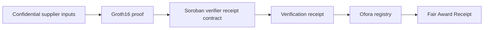

# Ofora

**Ofora makes confidential procurement decisions independently verifiable.**

Ofora is a hackathon MVP for procurement teams that need to protect supplier commercial information while proving that a contract award followed the selection rules locked before submissions began.

Repository: [github.com/Rex739/ofora](https://github.com/Rex739/ofora)

## Problem

Procurement teams are often forced to choose between exposing supplier commercial information or asking stakeholders to trust the final award decision.

That creates a credibility gap: auditors, funders, boards, and losing suppliers may need proof that the award followed the rules, but publishing raw bids can reveal prices, delivery terms, capabilities, documents, and other sensitive supplier data.

## Solution

Ofora locks supplier-selection rules before submissions, keeps commercial proposals protected, and verifies that the final award followed those rules.

The MVP combines a buyer-facing procurement workflow, a Groth16 proof, a Soroban verifier receipt contract, and an Ofora registry contract that finalizes a public Fair Award Receipt on Stellar testnet.

## Live Demo Scenario

**Emergency Solar Lantern Procurement**

- Meridian Industrial Ltd. is ineligible because it exceeds the locked 14-day delivery requirement.
- Atlas Supply Group is eligible but cannot win because another eligible supplier scored higher under the locked policy.
- Nova Relief Systems is validated as the correct award.
- Fair Award Receipt `FAR-OFR-2026-041-NOVA` is finalized on Stellar testnet.

## How Ofora Works

1. Create a tender and define supplier-selection rules.
2. Lock the rules before supplier submissions begin.
3. Receive confidential supplier proposals.
4. Commit to private bid data without publishing the raw inputs.
5. Generate a Groth16 proof that the selected supplier satisfies the locked policy and ranks at least as highly as every other eligible supplier.
6. Submit the proof to the Soroban verifier receipt contract.
7. Consume the verification receipt in the Ofora registry.
8. Finalize a public Fair Award Receipt for auditors and judges.

## What The ZK Proof Establishes

Ofora proves that the selected supplier satisfies the tender's locked minimum requirements and scores at least as highly as every other eligible supplier, without publishing confidential bid inputs.

The current final proof path is a Circom Groth16 circuit over BLS12-381. The circuit has one public input: `verificationContextCommitment`. That context commitment binds:

- selected supplier index;
- tender reference;
- receipt nonce;
- policy version;
- policy commitment;
- Atlas, Nova, and Meridian bid commitments;
- selected bid commitment.

The proof does **not** prove real-world supplier claims, document authenticity, or whether a supplier truly can deliver outside the committed data. It proves that the award follows the committed bid data and locked policy used by this MVP scenario.

## Privacy Model

Public:

- tender reference;
- policy commitment;
- bid commitments;
- verification context commitment;
- Fair Award Receipt;
- verification transaction reference;
- finalization transaction reference.

Private:

- supplier bid values;
- delivery inputs;
- quality/capability inputs;
- internal score inputs;
- salts;
- witness data;
- supporting documents and raw commercial dossiers.

## Stellar Architecture Diagram



The verifier receipt contract verifies Nova's Groth16 proof against the single public context commitment and stores a one-time verification receipt. The Ofora registry recomputes the expected context commitment from locked tender state, consumes the receipt, prevents reuse, and finalizes the Fair Award Receipt.

## Verified Stellar Testnet Evidence

The canonical public evidence is stored in [`public/verification/ofora-testnet-evidence.json`](public/verification/ofora-testnet-evidence.json) and matches the Groth16 demo artifacts in [`artifacts/ofora-groth16-demo/`](artifacts/ofora-groth16-demo/).

- Verifier receipt contract ID: `CDGHNWSNU43NOBSH7PBOJ7F25LJ66UXPZKL6I3C6PXCP6JBZHH4JFS4E`
- Registry contract ID: `CACEBZHKO5ONJSBFY372FOZQADRKNR23JXFYG7KQOAMGYZPN7ISCHDRS`
- Verification receipt transaction: `6daf9e1a7d2b4d237771352be4c392bb0febc3d72ddd3de375ef8693199d33f2`
- Registry finalization transaction: `e95f7d95fa716c24f4123f87c57ab478f3db1ffa92dcfa2ffaf4e1a1dbde527e`
- Fair Award Receipt ID: `FAR-OFR-2026-041-NOVA`
- Tender status: `Validated`
- Payment readiness: `ReadyForControlledRelease`

The product's Fair Award Record exposes copy actions and StellarExpert Testnet links for the public transaction and contract references in real evidence mode.

## Stack

- Next.js App Router
- TypeScript
- Tailwind CSS
- Playwright
- Circom Groth16
- BLS12-381 pairing verification
- Soroban smart contracts
- Stellar testnet

## Repository Structure

- [`app/`](app/) - Next.js routes, including `/demo`, `/audit`, `/tenders`, and `/supplier`
- [`components/`](components/) - product UI, audit record UI, app shell, and landing sections
- [`lib/`](lib/) - demo state, evaluation logic, validation helpers, and public Stellar evidence helpers
- [`zk-groth16/`](zk-groth16/) - Circom Groth16 circuit workspace
- [`contracts/generated-ofora-groth16-verifier/`](contracts/generated-ofora-groth16-verifier/) - Soroban Groth16 verifier receipt contract
- [`contracts/ofora-registry/`](contracts/ofora-registry/) - Ofora registry and Fair Award Receipt finalization contract
- [`artifacts/ofora-groth16-demo/`](artifacts/ofora-groth16-demo/) - public-safe Groth16 and Stellar testnet evidence artifacts
- [`scripts/groth16/`](scripts/groth16/) - circuit, proof, fixture, and local registry-finalization scripts
- [`scripts/stellar/`](scripts/stellar/) - Stellar testnet deployment, verification receipt, and finalization scripts
- [`public/verification/`](public/verification/) - frontend-safe public testnet evidence
- [`docs/`](docs/) - architecture, demo, runbooks, and submission notes
- [`tests/e2e/`](tests/e2e/) - Playwright regression tests

## Local Setup

Install dependencies and start the development server:

```bash
npm install
npm run dev
```

The Next.js dev server prints the local URL. Useful routes after it starts:

- `/` - landing page
- `/demo` - guided judge walkthrough
- `/demo/reset` - browser-local demo reset helper
- `/tenders/OFR-2026-041?evaluation=1` - confidential evaluation workspace
- `/audit/audit-ofr-2026-041` - public Fair Award Record

## Environment Variables

Safe defaults are documented in [`.env.example`](.env.example).

```bash
NEXT_PUBLIC_OFORA_VERIFICATION_MODE=mock
```

Mock mode is the default for local development. It uses local/browser demo state and does not present testnet explorer actions as if they were live submissions.

Real evidence mode:

```bash
NEXT_PUBLIC_OFORA_VERIFICATION_MODE=real
```

Real mode reads public, already-confirmed testnet references from [`public/verification/ofora-testnet-evidence.json`](public/verification/ofora-testnet-evidence.json). It does not generate proofs or submit transactions from the browser.

The Stellar script variables in `.env.example` are intentionally blank. Do not commit funded source-account secrets, seed phrases, private keys, raw witnesses, salts, proving keys, or local identity files.

## Mock Mode Versus Real Evidence Mode

`NEXT_PUBLIC_OFORA_VERIFICATION_MODE=mock`

- uses browser-local sample workflow state;
- labels validation as local demo evaluation;
- shows `Demo Award Summary`;
- hides Stellar testnet explorer links and transaction-hash copy actions.

`NEXT_PUBLIC_OFORA_VERIFICATION_MODE=real`

- reads safe public evidence from `public/verification/ofora-testnet-evidence.json`;
- labels the validated award as `VERIFIED ON STELLAR TESTNET`;
- shows the confirmed Fair Award Receipt, verification transaction, finalization transaction, verifier contract, and registry contract;
- provides copy and StellarExpert Testnet open actions for public evidence;
- does not reveal losing suppliers' confidential commercial details.

## Commands To Run Checks And Tests

Frontend and app checks:

```bash
npm run lint
npm run typecheck
npm run build
npm run test:e2e
```

Playwright is included in `devDependencies`. In a fresh machine or CI image, install browser binaries before E2E tests if they are not already present:

```bash
npx playwright install
```

Groth16 and contract checks:

```bash
scripts/groth16/test-ofora-registry-finalization.sh
cargo test --offline --manifest-path contracts/generated-ofora-groth16-verifier/Cargo.toml
cargo test --offline --manifest-path contracts/ofora-registry/Cargo.toml
```

The Rust commands require the Rust toolchain and cached dependencies for `--offline`. If dependencies are not cached, run without `--offline` in an environment with registry access.

## Testnet Reproduction / Runbook Reference

The deployed canonical evidence is already confirmed; the frontend demo does not replay testnet transactions.

Primary runbooks:

- [Groth16 proof-backed finalization](docs/zk/ofora-proof-backed-finalization.md)
- [Groth16 trust setup note](docs/zk/ofora-groth16-trust-setup.md)
- [Testnet deployment notes](docs/zk/ofora-testnet-deployment.md)
- [Testnet runbook](docs/zk/ofora-testnet-runbook.md)

Relevant scripts:

```bash
scripts/stellar/deploy-ofora-groth16-receipt-verifier-testnet.sh
scripts/stellar/deploy-ofora-registry-finalization-testnet.sh
scripts/stellar/configure-ofora-verifier-registry.sh
scripts/stellar/submit-nova-verification-receipt-testnet.sh
scripts/stellar/finalize-nova-award-testnet.sh
scripts/stellar/inspect-ofora-finalization-testnet.sh
```

These scripts require the Stellar CLI, testnet network configuration, and a funded testnet source account kept outside git.

## Limitations

- This is a hackathon MVP, not a production procurement system.
- Payment release and escrow are not implemented. `ReadyForControlledRelease` is a readiness/status flag only; no funds are transferred.
- The current Groth16 trusted setup is development/hackathon-grade only and requires a production ceremony/security review before real procurement use.
- Some prototype workflow state remains browser-local.
- Supplier submissions are demo/prototype flows, not production-grade secure storage.
- Production deployment would require authenticated organizations, RBAC, secure server-side submission handling, audit logging, key management, procurement integrations, and a full security review.
- The proof verifies consistency with committed data and locked policy; it does not certify real-world supplier truthfulness or document authenticity.

## License

MIT
