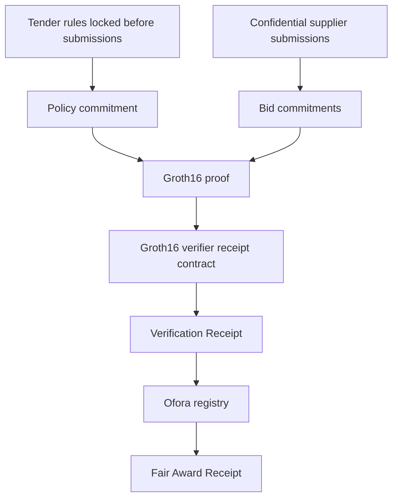

# Ofora Architecture

## Contracts

- `contracts/generated-ofora-groth16-verifier` verifies the Groth16 proof and stores a single-use receipt.
- `contracts/ofora-registry` recomputes the expected public verification context from stored tender state and consumes the receipt before finalizing an award.

## Public Data

- tender reference
- policy commitment
- bid commitments
- verification context commitment
- receipt and transaction references

## Protected Data

- bid prices
- delivery details
- capability and quality inputs
- internal scores
- salts
- witnesses

## Non-goals In This MVP

- escrow
- payment execution
- production trusted setup ceremony
- browser proof generation
